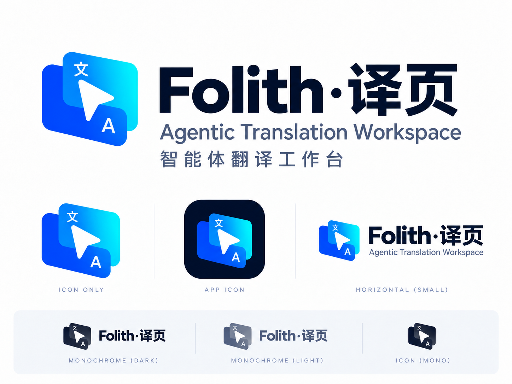
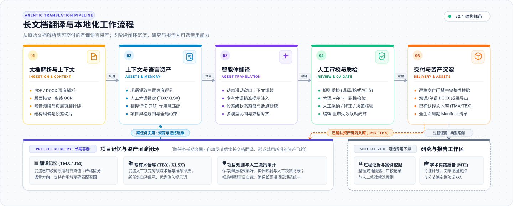

# Folith

<p align="center">
  
</p>

<p align="center"><sub>Folith·译页的 logo、字标与配色基准见 <a href="docs/brand.md">docs/brand.md</a>。</sub></p>

Folith·译页是一套面向专业本地化工作的 Agentic Workspace：把文档结构、上下文、术语、译文、人工审校和交付资产放在同一条可恢复的工作线上。

它适合处理较长的 PDF / DOCX 文档，保持跨章节的一致性，保留人工决策与证据，并在中断后从本地任务状态继续处理。

## Product position

Folith·译页的品牌定位是 **Agentic Translation Workspace**；中文界面使用 **智能体翻译工作台**。长文档是主场景，主路径是：

```text
文档解析 → 文档上下文 → 术语与翻译记忆 → 翻译 → 人工审校 → 交付
```

“研究与报告”是可选的专用能力，服务于需要过程证据、案例分析或 MTI 翻译实践报告的任务；它不占据普通本地化任务的首屏，也不定义 Folith·译页的唯一使用场景。

## 当前能力与下一步

当前本地开发已推进项目管理、语言资产、工作台、人工审校与可恢复交付。TM 提供精确/归一化复用和基础 TMX 导入导出；当前 DOCX 导出属于生成式输出，尚不承诺保留原文件 package、复杂结构或全部格式。

当前版本已作为 Folith·译页 v0.4.0 发布。后续优先完成 DOCX 原格式写回闭环，再推进 TM V2 与文档版本更新；这些是路线规划，不是当前版本的能力声明。

- [开发蓝图与当前进度](docs/foliothread-agentic-native-blueprint.md)
- [近期正式版发布计划](docs/release-plan.md)
- [DOCX Contract v1：支持范围与验收](docs/docx-contract-v1.md)

## Quick Start

### 安装 v0.4.0

需要 Python 3.10 或更高版本。

从 [Folith Releases](https://github.com/xueyang-dev/Folith/releases) 下载
`foliothread-0.4.0-py3-none-any.whl`（已发布包的兼容文件名），然后运行：

```bash
python -m pip install ./foliothread-0.4.0-py3-none-any.whl
folith
```

首次启动后，在设置中选择 provider、model 并填写 API key。如需检查启动参数：

```bash
folith --help
```

### 从源码安装

```bash
git clone https://github.com/xueyang-dev/Folith.git
cd Folith
python -m pip install .
folith
```

仓库同时提供启动器：Windows 双击 `start.bat`，macOS 双击
`start.command`，macOS/Linux 运行 `./start.sh`。如需仅启动本地服务而不自动打开窗口，使用
`folith --no-browser`。桌面窗口需要安装 `requirements-desktop.txt` 中的可选依赖。

v0.4 的 Python 模块命名空间仍为 `transpraxis`，`foliothread` 与 `transpraxis` console 命令作为兼容别名保留，以便已有本地任务继续运行；新的产品入口统一使用 `folith`。

## 工作流程

<p align="center">
  <a href="docs/assets/folith-workflow.html">
    
  </a>
</p>

### 1. 文档与上下文

PDF 路径支持版面段落恢复及页眉、页脚、页码和断词处理；DOCX 当前主要提取正文段落，不代表复杂结构完整提取或原格式保真写回。**提取范围（本次提取了什么、哪些表格/页眉页脚/文本框/公式/脚注未纳入、导出是重建译文文档而非原格式写回）会在任务里明确列出**，不静默漏内容。长文翻译阶段使用章节、语义单元和相邻段落构建上下文；已确认的译文可用于后续批次的上下文参考。

扫描 PDF 没有文本层时，Folith 会自动调用本机 Tesseract OCR：Step 1 的画像先识别前 / 中 / 后代表页，正式翻译阶段再识别全文，并把 OCR 段落保存为阶段一断点。PDF 的文本层或 OCR 结果随后会经过一次结构化 LLM 原文纠错：只修复明显错字和版面断行，保留每个输入项并记录原始文本，避免把模型当作自由改写器。OCR 在本机执行，不会把页面图片上传到服务商。请先安装 Tesseract 及需要的语言包；例如 macOS Homebrew 可运行：

```bash
brew install tesseract tesseract-lang
```

如果应用是从桌面图标启动、找不到自定义安装路径，可设置：

```bash
export FOLIOTHREAD_TESSERACT_CMD="/path/to/tesseract"
```

缺少 Tesseract 或语言包时，任务会把具体原因显示在界面并写入 `runtime_technical.log`，不会伪装成普通文本解析成功。

### 2. 术语与翻译记忆

支持提取术语候选，并对候选进行编辑、锁定、拒绝和冻结。翻译阶段仅注入当前范围相关的术语，以减少无关术语对模型上下文的占用。术语资产可导出为 XLSX 或 TBX；通过审校的译文可进入 TMX 翻译记忆。

### 3. 翻译与人工审校

审校阶段检查漏译、占位符、URL、引用标记和术语使用，并可关联文档证据。修订候选采用独立评估流程，审校与修订记录保存在任务中，便于追溯。

段落编辑有明确的保存入口和成功反馈，并提供「保存并进入下一段 / 下一未确认段」「复制原文到译文」「翻译当前段落」等连续操作。未保存内容在切换段落、筛选、任务，以及**刷新页面或关闭标签页**之后都不会丢失：草稿落盘在任务目录里，重新打开会恢复并明确告知（草稿不是正式译文，不会因此获得审校结论）。冻结交付前会先检查未保存修改，避免导出修改前的版本；同一任务在别处改过同一段时，保存会先提示两边内容让你选择，而不是静默覆盖。拆分、合并、插入等结构操作可以撤销到操作前内容。导入扫描件产生的 OCR 垃圾行、页码、重复页眉等无效段落可以「排除」：保留原文、随时可恢复、不进入翻译、不计入待完成数量，导出时按明确规则单独列出。

保存与审校确认是两件事：保存只写入译文，**不会**把段落标记为已审校；反过来说，若这一段此前已审校，人工修改后那次审校结论会**作废**并需要重新审校。

### 4. 交付与恢复

任务可按需导出纯译文/双语 DOCX、PDF、重点标注版、术语、翻译记忆、JSONL 双语段落、证据文件和 `delivery_manifest.json`。人工确认后的资产可冻结为可追溯的交付快照；任务状态保存在本地，长文中断后可继续处理。若有被排除的无效段落，交付包会额外包含它们的清单，双语 JSONL 不含其原文。

### 5. 研究与报告（专用能力）

可选的研究工作流把翻译过程、案例、证据、研究问题和提纲组织为写作工作区，并生成翻译实践报告草稿。它适用于 MTI 作业和研究型翻译，但不改变 Folith 的主产品路径；生成的译文、事实说明、引文和理论解释仍需人工核查。

## 三种预设

- **快速**：适合试译和预览；保留 TM 和基础检查，不自动提取术语，也不启用独立审校。
- **标准**：默认选项；自动提取术语，保留 TM，完成常规翻译和基础检查。
- **研究与报告（专用）**：适合需要完整过程证据的任务；在标准设置上增加严格术语准备、独立审校和研究报告工作区。

预设只提供默认配置，翻译前仍可按任务调整策略和输出内容。

## 输出

常用输出包括：

- 纯译文/双语 DOCX、PDF、重点标注版 DOCX；
- 术语表 XLSX、TBX；
- TMX 翻译记忆、JSONL 双语段落；
- `delivery_manifest.json`、证据文件、审校发现与审校报告；
- 可选的研究工作区 ZIP 和翻译实践报告 DOCX/Markdown 草稿。

## Provider 与命令行

界面支持 OpenCode Go、DeepSeek、OpenAI、Gemini、OpenRouter、SiliconFlow、Moonshot/Kimi、Zhipu/GLM、Qwen/DashScope，以及自定义 OpenAI-compatible endpoint。Provider、模型、API Key 和可选 Base URL 均在设置中配置。自定义中转站必须填写有效的 `http(s)://…/v1` 基址；缺少地址时请求会直接提示配置错误，不会把中转站密钥发送到官方 OpenAI 地址。已识别的推理模型会额外提供“推理强度”，默认自动模式不发送额外参数。

脚本化处理可在源码目录运行：

```bash
export TRANSPRAXIS_API_KEY="your-api-key"
python scripts/translate_pdf.py "文档.pdf" --target-lang 简体中文 --quality
```

`TRANSPRAXIS_API_KEY` 是 v0.4 保留的环境变量名，避免改变核心运行行为；新的用户界面和命令入口使用 Folith / 译页品牌。完整参数见 `python scripts/translate_pdf.py --help`。

## 架构边界

Folith·译页的长期方向是 Agentic Translation Workspace：由 Agent 执行受边界约束的本地化工作，由人类控制语言质量和交付责任。完整的产品与架构蓝图见[Agentic Translation Workspace 开发蓝图](docs/foliothread-agentic-native-blueprint.md)。当前 v0.4 的兼容边界和 MTI 专用能力见[架构边界说明](docs/architecture-boundaries.md)。

## 使用说明与限制

AI 生成的译文和实践报告仅作为工作稿，提交前应人工核对事实、术语、引文和理论判断。`--lan` 当前采用受信任局域网模式，不包含认证层；不应暴露到不受信任的网络。LAN 认证不在 v0.4.0 范围内。

## 文档

- [翻译工作台：Agent Inspector 交互契约](docs/agent-inspector-workspace.md)
- [历史任务：Translation Task 列表](docs/history-task-list.md)
- [Project：任务、术语、风格规则与已审校记忆的长期容器](docs/project-memory.md)
- [翻译吞吐实测](docs/translation-throughput.md)
- [控制台闭环](docs/console-loop.md)
- [场景验收门禁](docs/scenario-gate.md)
- [架构边界说明](docs/architecture-boundaries.md)
- [学术写作架构](docs/academic-writing-architecture.md)
- [文献证据链](docs/literature-evidence-spine.md)
- [变更记录](CHANGELOG.md)
- [MIT License](LICENSE)

## 开发与发布验证

```bash
python -m pip install ".[test]" build
python -m pytest -q
python -m build
```

三个端到端验收场景（20 页 DOCX、100 页 PDF、术语密集文档）由
`tests/scenario_gate_test.py` 离线验证，随 `python -m pytest -q` 一起运行；
源文档由 `python scripts/make_scenario_fixtures.py --out tmp/scenarios` 生成。
详见[场景验收门禁](docs/scenario-gate.md)。
