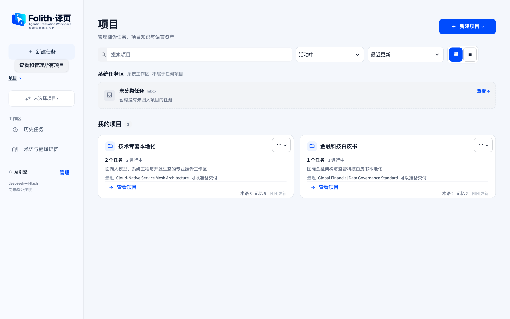
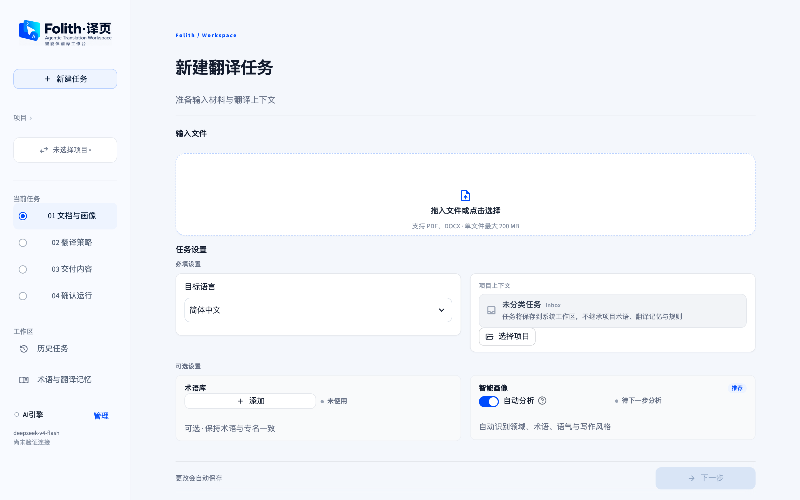
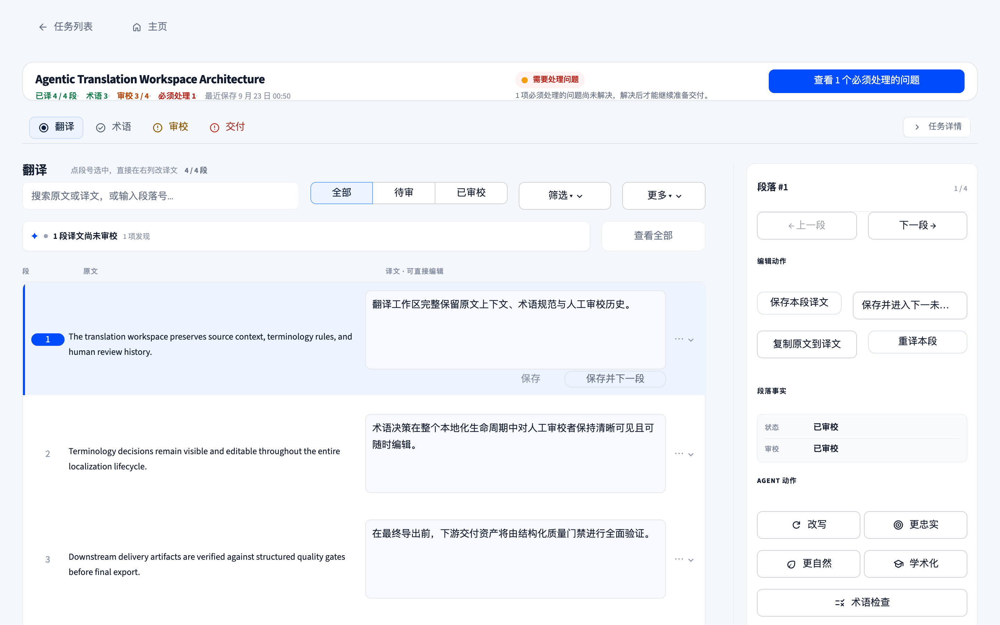
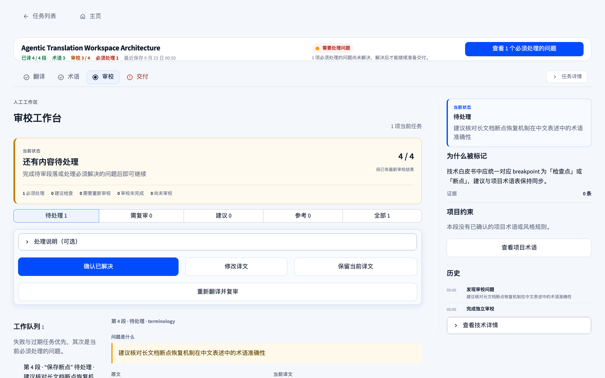
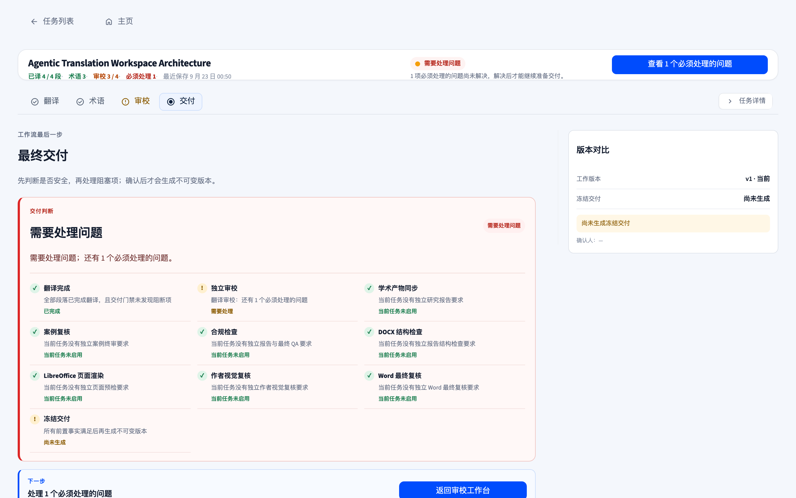
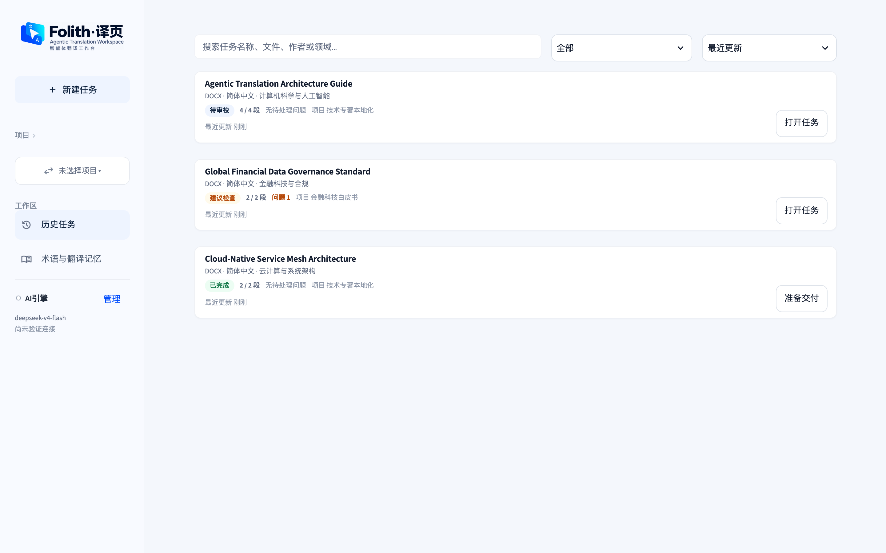
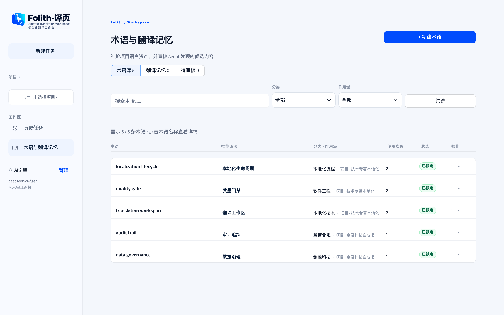

# Folith · 译页

<p align="center">
  
</p>

<p align="center">
  <strong>面向长文档与专业本地化的智能体翻译工作台 (Agentic Translation Workspace)</strong>
</p>

<p align="center">
  <a href="https://github.com/xueyang-dev/Folith/releases"></a>
  <a href="LICENSE"></a>
  <a href="https://www.python.org/downloads/"></a>
</p>

---

**Folith · 译页** 是一套专为复杂、长篇幅文献与技术文档设计的本地化智能体工作台。不同于通用对话界面的简单改写，Folith 将**文档结构保真提取**、**全书上下文建模**、**术语与翻译记忆（TM）闭环**、**智能体双语翻译**、**深度人工审校**与**可审计交付资产**整合在一条可中断、可恢复的工程化流水线中。

无论是数百页的学术专著、技术白皮书、行业报告还是产品本地化资料，Folith 都能保持全篇概念与用词的高度一致，完整保留译者决策证据链，保障高水准成果交付。

---

## 📸 界面预览 (Showcase)

### 1. 多项目管理中心 (Project Center)
集中管理不同领域的本地化项目，各项目独立沉淀术语规范与翻译记忆；支持按状态快速检索、任务归档与资产汇总。

<p align="center">
  
</p>

### 2. 新建任务向导与上下文配置 (New Task Wizard)
结构化四步创建向导（文档与画像 → 翻译策略 → 交付内容 → 确认运行），支持 PDF / DOCX 拖拽上传、目标语言选择、项目上下文关联与智能画像识别。

<p align="center">
  
</p>

### 3. 智能体翻译工作台 (Translation Workbench)
双语段落平行对齐，顶部横幅清晰展示进度、术语数与阻断状态；右侧实时提供段落事实、Agent 智能改写、术语核验与快捷编辑动作。

<p align="center">
  
</p>

### 4. 智能体审校与质检工作区 (Review & Quality Gate)
结构化审校队列与问题分类（术语冲突、句式偏离、格式异常），即时展现上下文解释与建议译文，支持采纳、修正与决策归档。

<p align="center">
  
</p>

### 5. 交付门禁与成果导出 (Delivery & Quality Verification)
在正式导出前对翻译完整性、独立审校、合规状态与结构保真进行全景门禁核验；阻断项未解决前严格防护，支持生成双语对照与交付清单。

<p align="center">
  
</p>

### 6. 任务流水线与历史看板 (Task History & Resume)
统一展示所有执行中的翻译任务与历史归档，提供状态流转标签、进度读数与快捷恢复动作；意外中断的任务可秒级接续断点。

<p align="center">
  
</p>

### 7. 语言资产库：术语与翻译记忆 (Language Assets & Terminology)
跨任务沉淀高价值语料，支持术语锁定、作用域隔离、推荐译法与多格式（XLSX / TBX / TMX）导入导出，形成越用越准的资产飞轮。

<p align="center">
  
</p>

---

## ⚡ 核心特性 (Key Features)

- **📚 长文档结构感知与保真提取**：针对 PDF 与 DOCX 进行深度结构解析，支持跨页排版恢复、断词修复、页眉页脚与无意义噪音频段排除，支持本地 Tesseract OCR 离线识别。
- **🧠 动态上下文与跨章节一致性**：引入滑动上下文窗口与章节摘要索引，翻译当前段落时智能检索前后文与专有名词，杜绝“断章取义”与术语前后矛盾。
- **💎 语言资产闭环 (TM & Terminology)**：内置精确匹配与归一化翻译记忆复用；支持项目术语抽取、锁定与精准注入，大幅削减大模型 Token 开销与无关幻觉。
- **🛡️ 状态解耦与人工责任闭环**：保存译文与审校确认严格分离，段落经人工编辑后自动触发重新审校校验；任务状态实时落盘，遭遇浏览器刷新或意外中断可秒级恢复。
- **📦 标准化交付与过程证据包**：支持纯译文 DOCX、双语对照 DOCX、重点标注版、术语表、TMX 记忆库、结构化 JSONL 数据集以及 `delivery_manifest.json` 交付清单。
- **🎓 专用研究与报告工作流**：支持将翻译过程、案例对比、理论支持与反思复盘导出为结构化分析与实践报告，满足翻译硕士 (MTI) 等学术与专业评估需求。

---

## 🔄 工作流程 (Architecture)

<p align="center">
  <a href="docs/assets/folith-workflow.html">
    
  </a>
</p>

| 阶段 | 核心任务与工程能力 |
| :--- | :--- |
| **1. 文档解析与上下文** | 版面分析、段落提取、噪音频段排除、离线 OCR（无网络隐私泄露）、轻量结构化纠偏与上下文切片 |
| **2. 术语与资产准备** | 自动化术语候选抽取、置信度评分、人工锁定/冻结、多格式术语导入导出 (XLSX / TBX) |
| **3. 智能体翻译** | 动态上下文组装、相关术语精准注入、断点缓存保存、多模型并行加速 |
| **4. 人工审校与质检** | 规则质检（漏译、占位符、标点、术语一致性）、问题定位导航、编辑-重审联动闭环 |
| **5. 交付与资产沉淀** | 交付门禁校验、多格式成果物导出、已确认译文入库 (TMX)、全生命周期清单落盘 |

---

## 🚀 快速上手 (Quick Start)

### 系统要求
- Python 3.10 或更高版本
- macOS / Windows / Linux
- （可选）[Tesseract OCR](https://github.com/tesseract-ocr/tesseract)（如需离线识别扫描件 PDF）

### 方式 1：通过 Pip 安装发布包（推荐）

```bash
# 从 Releases 下载最新 wheel 包
python -m pip install foliothread-0.4.0-py3-none-any.whl

# 启动工作台
folith
```

### 方式 2：从源码运行与开发

```bash
# 克隆仓库
git clone https://github.com/xueyang-dev/Folith.git
cd Folith

# 安装依赖
python -m pip install -e .

# 启动工作台
folith
```

仓库根目录提供一键启动脚本：
- **Windows**: 双击运行 `start.bat`
- **macOS**: 双击运行 `start.command` 或在终端运行 `./start.sh`
- **Linux**: 运行 `./start.sh`

> **参数说明**：
> - 仅启动后台服务不打开浏览器：`folith --no-browser`
> - 局域网协同模式：`folith --lan`
> - 原生桌面窗口支持：安装可选依赖 `python -m pip install ".[desktop]"` 后启动即可进入原生窗口模式。

---

## ⚙️ 模型与服务商支持 (Providers)

Folith 采用模块化模型接入架构，在系统设置中支持开箱即用配置：

- **主流服务商**：OpenAI、Gemini、DeepSeek、OpenRouter、SiliconFlow (硅基流动)、Moonshot / Kimi、Zhipu / GLM、Qwen / DashScope、OpenCode Go
- **自定义网关**：支持任何遵循 OpenAI API 规范的第三方兼容网关或本地模型服务 (vLLM / Ollama)
- **深度思考控制**：支持带思维链的推理模型（如 DeepSeek-R1、OpenAI o-series），可自定义推理强度

---

## 🗺️ 路线图 (Roadmap)

- [x] **v0.4.0**：统一 Folith 品牌体系、交互界面重构、语言资产与术语中心、交付门禁系统与草稿实时容灾
- [ ] **v0.5.0**：DOCX 原格式保真写回（基于 XML 模板的原位段落替换，保留原始排版、样式与内嵌图表）
- [ ] **v0.6.0**：TM V2 引擎（支持多语料库检索与模糊匹配评分、增强型 TMX 分段索引）
- [ ] **v0.7.0**：文档跨版本差分更新与增量翻译同步

---

## 📖 详细文档 (Documentation)

- [智能体交互面板契约 (Agent Inspector)](docs/agent-inspector-workspace.md)
- [历史任务与状态迁移](docs/history-task-list.md)
- [项目与长期记忆模型](docs/project-memory.md)
- [DOCX Contract v1 规范](docs/docx-contract-v1.md)
- [架构设计与能力边界](docs/architecture-boundaries.md)
- [变更日志 (Changelog)](CHANGELOG.md)

---

## 📄 开源许可证 (License)

本项目基于 [MIT License](LICENSE) 开源。
