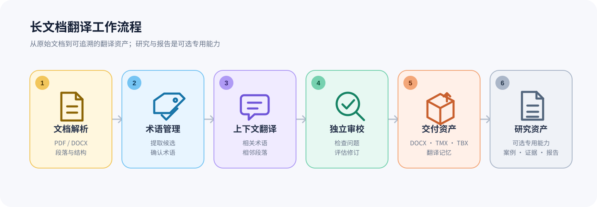

# FolioThread

<p align="center">
  
</p>

<p align="center"><strong>Long-document Translation Workspace</strong></p>

FolioThread 是一套面向长文档的本地翻译工作空间：把文档结构、上下文、术语、译文、人工审校和交付资产放在同一条可恢复的工作线上。

它适合处理较长的 PDF / DOCX 文档，保持跨章节的一致性，保留人工决策与证据，并在中断后从本地任务状态继续处理。

## Product position

FolioThread 的一级产品定位是 **长文档翻译工作空间**，主路径是：

```text
文档解析 → 文档上下文 → 术语与翻译记忆 → 翻译 → 人工审校 → 交付
```

“研究与报告”是可选的专用能力，服务于需要过程证据、案例分析或 MTI 翻译实践报告的任务；它不占据普通翻译任务的首屏，也不定义 FolioThread 的唯一使用场景。

## Quick Start

### 安装 v0.4.0

需要 Python 3.10 或更高版本。

从 [FolioThread Releases](https://github.com/xueyang-dev/FolioThread/releases) 下载
`foliothread-0.4.0-py3-none-any.whl`，然后运行：

```bash
python -m pip install ./foliothread-0.4.0-py3-none-any.whl
foliothread
```

首次启动后，在设置中选择 provider、model 并填写 API key。如需检查启动参数：

```bash
foliothread --help
```

### 从源码安装

```bash
git clone https://github.com/xueyang-dev/FolioThread.git
cd FolioThread
python -m pip install .
foliothread
```

仓库同时提供启动器：Windows 双击 `start.bat`，macOS 双击
`start.command`，macOS/Linux 运行 `./start.sh`。如需仅启动本地服务而不自动打开窗口，使用
`foliothread --no-browser`。桌面窗口需要安装 `requirements-desktop.txt` 中的可选依赖。

v0.4 的 Python 模块命名空间仍为 `transpraxis`，旧的 `transpraxis` console 命令也暂时保留，以便已有本地任务继续运行；新的产品入口统一使用 `foliothread`。

## 工作流程

<p align="center">
  <a href="docs/assets/foliothread-workflow.html">
    
  </a>
</p>

### 1. 文档与上下文

支持按版面重建 PDF/DOCX 段落，并处理页眉、页脚、页码和断词。长文翻译阶段使用章节、语义单元和相邻段落构建上下文；已确认的译文可用于后续批次的上下文参考。

### 2. 术语与翻译记忆

支持提取术语候选，并对候选进行编辑、锁定、拒绝和冻结。翻译阶段仅注入当前范围相关的术语，以减少无关术语对模型上下文的占用。术语资产可导出为 XLSX 或 TBX；通过审校的译文可进入 TMX 翻译记忆。

### 3. 翻译与人工审校

审校阶段检查漏译、占位符、URL、引用标记和术语使用，并可关联文档证据。修订候选采用独立评估流程，审校与修订记录保存在任务中，便于追溯。

### 4. 交付与恢复

任务可按需导出纯译文/双语 DOCX、PDF、重点标注版、术语、翻译记忆、JSONL 双语段落、证据文件和 `delivery_manifest.json`。人工确认后的资产可冻结为可追溯的交付快照；任务状态保存在本地，长文中断后可继续处理。

### 5. 研究与报告（专用能力）

可选的研究工作流把翻译过程、案例、证据、研究问题和提纲组织为写作工作区，并生成翻译实践报告草稿。它适用于 MTI 作业和研究型翻译，但不改变 FolioThread 的主产品路径；生成的译文、事实说明、引文和理论解释仍需人工核查。

## 三种预设

- **快速**：适合试译和预览；保留 TM 和基础检查，不自动提取术语，也不启用独立审校。
- **标准**：默认选项；自动提取术语，保留 TM，完成常规翻译和基础检查。
- **研究与报告（专用）**：适合需要完整过程证据的任务；在标准设置上增加严格术语准备、独立审校和研究报告工作区。

预设只提供默认配置，翻译前仍可按任务调整策略和输出内容。

## 输出

常用输出包括：

- 纯译文/双语 DOCX、PDF、重点标注版 DOCX；
- 术语表 XLSX、TBX；
- TMX 翻译记忆、JSONL 双语段落；
- `delivery_manifest.json`、证据文件、审校发现与审校报告；
- 可选的研究工作区 ZIP 和翻译实践报告 DOCX/Markdown 草稿。

## Provider 与命令行

界面支持 OpenCode Go、DeepSeek、OpenAI、Gemini、OpenRouter、SiliconFlow、Moonshot/Kimi、Zhipu/GLM、Qwen/DashScope，以及自定义 OpenAI-compatible endpoint。Provider、模型、API Key 和可选 Base URL 均在设置中配置。

脚本化处理可在源码目录运行：

```bash
export TRANSPRAXIS_API_KEY="your-api-key"
python scripts/translate_pdf.py "文档.pdf" --target-lang 简体中文 --quality
```

`TRANSPRAXIS_API_KEY` 是 v0.4 保留的环境变量名，避免改变核心运行行为；新的用户界面和命令入口使用 FolioThread 品牌。完整参数见 `python scripts/translate_pdf.py --help`。

## 架构边界

Phase 1 只完成产品重定位，不改核心 runtime 行为。v0.4 基础设施、MTI 专用能力和 v0.5 演化方向见[架构边界说明](docs/architecture-boundaries.md)。

## 使用说明与限制

AI 生成的译文和实践报告仅作为工作稿，提交前应人工核对事实、术语、引文和理论判断。`--lan` 当前采用受信任局域网模式，不包含认证层；不应暴露到不受信任的网络。LAN 认证不在 v0.4.0 范围内。

## 文档

- [架构边界说明](docs/architecture-boundaries.md)
- [学术写作架构](docs/academic-writing-architecture.md)
- [文献证据链](docs/literature-evidence-spine.md)
- [变更记录](CHANGELOG.md)
- [MIT License](LICENSE)

## 开发与发布验证

```bash
python -m pip install ".[test]" build
python -m pytest -q
python -m build
```
